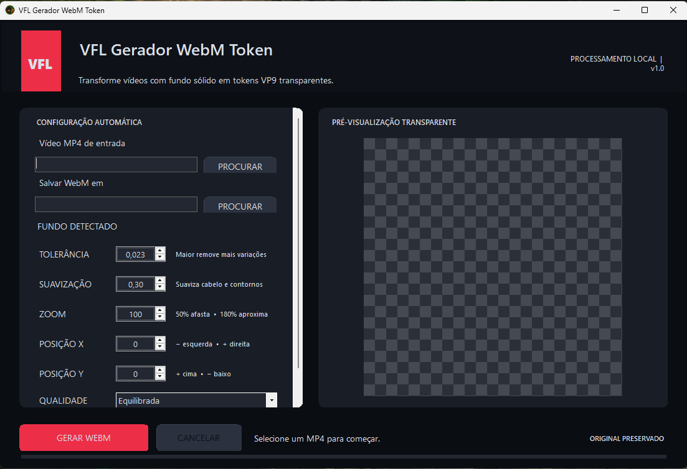

# VFL Gerador WebM Token

Aplicativo Windows para transformar vídeos com fundo sólido — verde, azul ou outra cor — em tokens **WebM VP9 com transparência**, prontos para uso no Foundry VTT.



## Principais recursos

- Detecção automática da cor de fundo.
- Pré-visualização transparente em referência fixa 1:1.
- Linha do tempo com precisão de milissegundos e reprodução fluida a 24 FPS, com Play, Pausa e Stop.
- Miniatura PNG automática com o mesmo enquadramento e quadriculado da prévia.
- Remoção de fundo com máscara alfa reforçada.
- Zoom e posicionamento horizontal/vertical com atualização automática.
- Saída fixa em 1080×1080, 24 FPS, VP9 com alfa.
- FFmpeg 8.1 e FFprobe portáteis incluídos no pacote para Windows.
- Preset **Alpha VP9** confirmado para uso no Foundry VTT.
- Áudio opcional em Vorbis.
- Nomes sequenciais para evitar cache do Foundry.
- Processamento totalmente local; o vídeo original nunca é alterado.
- Interface escura.

## Requisitos

Windows 10 ou 11 de 64 bits. O pacote da seção **Releases** já inclui o FFmpeg necessário: não é preciso instalar Kdenlive, codecs ou outros programas.

## Como usar

1. Baixe o ZIP na seção **Releases** e extraia a pasta inteira.
2. Abra `VFL.GeradorWebMToken.exe`.
3. Selecione o vídeo com fundo sólido.
4. Confira a prévia e ajuste zoom, posições X/Y, tolerância ou suavização se necessário.
5. Clique em **Gerar WebM**.
6. Importe o novo arquivo `_TOKEN.webm` no Foundry.

Reprodutores comuns podem mostrar o fundo verde porque não interpretam alfa em VP9. Dentro do Foundry, o fundo fica transparente.

## Configuração padrão da versão 2.0

- Tolerância: `0,023`
- Suavização: `0,30`
- Qualidade: Equilibrada (`CRF 15`)
- Bitrate: `20M`
- GOP: `15`
- Formato: `yuva420p`
- Áudio: Vorbis qualidade 4

## Compilar o código

Requisitos para desenvolvimento: Windows e .NET 8 SDK. Para publicar uma distribuição completa, coloque a versão Windows compartilhada do FFmpeg 8.1 dentro de `Tools` antes de executar `dotnet publish`.

```powershell
dotnet build -c Release
dotnet publish -c Release -r win-x64 --self-contained true
```

## Licença

Uso pessoal e não comercial permitido. Venda e uso comercial são proibidos sem autorização. Este é um projeto **source-available**, não uma licença open source aprovada pela OSI.

Consulte [LICENSE.md](LICENSE.md) para os termos completos.

O FFmpeg incluído na distribuição mantém sua própria licença GPL. Consulte [FFMPEG-NOTICE.md](FFMPEG-NOTICE.md) e `THIRD-PARTY-FFMPEG-LICENSE.txt`.
